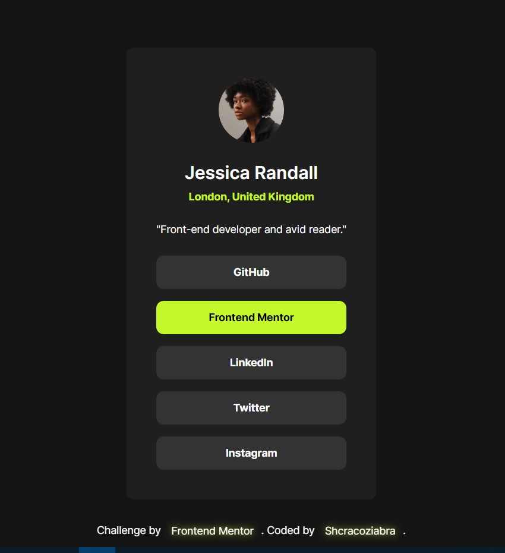

# Frontend Mentor - Social links profile solution

This is a solution to the [Social links profile challenge on Frontend Mentor](https://www.frontendmentor.io/challenges/social-links-profile-UG32l9m6dQ). Frontend Mentor challenges help you improve your coding skills by building realistic projects. 

## Table of contents

- [Overview](#overview)
  - [The challenge](#the-challenge)
  - [Screenshot](#screenshot)
  - [Links](#links)
- [My process](#my-process)
  - [Built with](#built-with)
  - [What I learned](#what-i-learned)
- [Author](#author)

## Overview

### The challenge

In this challenge I practised to create responsive web page and added transitions for focus and hover states of interactive elements.

### Screenshot



### Links

- Solution URL: [GitHub](https://github.com/Shcracoziabra/social-links-profile)
- Live Site URL: [Netlify](https://shcraco-social-links-profile.netlify.app)

## My process

### Built with

- Semantic HTML5 markup
- BEM methodology
- CSS Grid
- CSS media queries 

### What I learned

Made an animated underline effect for the links in a footer using `::after` pseudoelement.

```css
footer>a::after {
    content: "";
    position: absolute;
    bottom: 0;
    left: 0;
    width: 0;
    height: 2px;
    background-color: var(--green);
    transition: all .2s linear
}

footer>a:hover::after {
    width: 100%;
}
```

## Author

- GitHub - [Tetiana B.](https://github.com/Shcracoziabra)
- Frontend Mentor - [@Shcracoziabra](https://www.frontendmentor.io/profile/Shcracoziabra)
